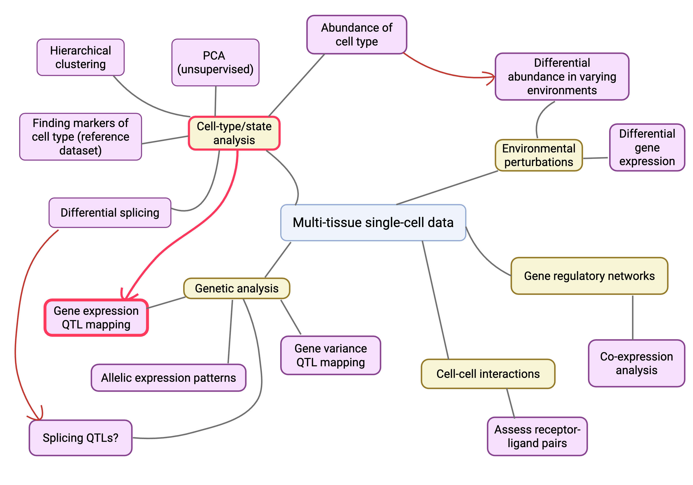

# Single-cell molecular QTL mapping

Welcome to the downstream analysis arm of the molecular mechanisms cluster at the University of Edinburgh. If you have any questions, ideas or would like to collaborate, please reach out to silvia.shen[at]ed.ac.uk.  

**Aims**

Our aims are as follows (taken from the [FGI website](https://www.ukfunctionalgenomics.com/research/molecular-mechanisms-cluster/)). 

"This research cluster will tackle the “missing link” between the genome and disease. Our aim is to identify molecules in our bodies that cause disease by looking at how tiny variations in the genome change these molecules in single cells. We will create a unique dataset by reading molecular signals in human cells donated by hundreds of patients, potentially leading to ideas for new, effective drugs. ... In the Molecular Mechanisms Cluster we hold ourselves to a simple measure of success: the number of disease genes explained (number of disease-associated common genetic variants significantly colocalising with molecular quantitative trait loci)."

⭐️ Identify QTLs  
⭐️ Create open source database of QTLs  
⭐️ Colocalise QTLs  
⭐️ Further analysis of QTLs  

For an overview of the whole process, please see the [MMC powerpoint](https://uoe-my.sharepoint.com/:p:/r/personal/kcampb2_ed_ac_uk/Documents/MMC_PPA_notes.pptx?d=w3afaa31d5ccd4efea7dff2bf2b120465&csf=1&web=1&e=jjdB1P). For an overview of what we could do with the very exciting single-cell data, see figure below (the projects I am currently working on are highlighted in red).   

## eQTL mapping  
  
Please see the [single-cell eQTL mapping strategy](specification_docs/sc_eQTL_strategydoc.md) on proposed options for single-cell eQTL mapping. 

## Cell type analysis

- What known cell types are there in our samples?
- What cells are communicating with each other? (receptor-ligand pairs)
- How does the abundance of cell-types change?
  
## Future analysis ideas  
  
Please feel free to add any and all ideas you would like to implement (or see implemented by the team/me)!  
  
- Variance QTL mapping  
- Dynamic cell state/continuous cell state or phenotype mapping (perhaps go straight into this?)  
- Allelic imbalance analysis (see [key literature](specification_docs/key_literature.md))  
- Something with reads or tails of reads?   
- Producing a sc-eQTL atlas (similar to cattle gtex)  
- Which genes have the most variation across a single cell type? (and which SNPs/regions is this associated with) --> varQTLs
  

